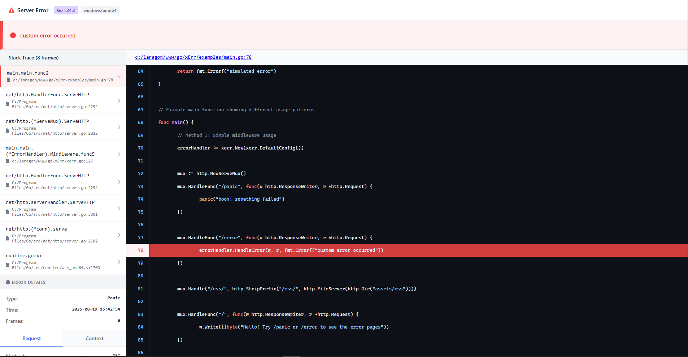

# xerr

`xerr` is a Go package for structured error handling and developer-friendly error pages. It provides:

* **Custom error type (`XErr`)** with stack trace support
* **Error classification** via `ErrorType` (built-in and custom)
* **Public messages** (safe for end-users)
* **Detailed HTML error pages** (with stack frames, code snippets, and request info)
* **Middleware** for integration with Go’s `http.Handler`



---

## Features

* Capture **panics** in HTTP handlers
* Middleware for `http.Handler` and `http.HandlerFunc`
* Stack frames with optional code snippets
* Go version, OS, architecture, and request details
* Configurable behavior:

  * `ShowSourceCode` (bool)
  * `MaxFrames` (int)
  * `Environment` (string)
  * `DebugMode` (bool)
  * `SkipFrames` (int)
* Works with `errors.Is` / `errors.As`
* Custom error types outside the package

---

## Installation

```bash
go get github.com/iMohamedSheta/xerr
```

---

## Usage

### Panic recovery with middleware

```go
package main

import (
    "net/http"
    "github.com/iMohamedSheta/xerr"
)

func main() {
    eh := xerr.NewErrorHandler(xerr.DefaultConfig())

    mux := http.NewServeMux()
    mux.HandleFunc("/", func(w http.ResponseWriter, r *http.Request) {
        panic("Something went wrong!")
    })

    http.ListenAndServe(":8080", eh.Middleware(mux))
}
```

---

### Handle errors manually

```go
eh := xerr.NewErrorHandler(nil)

http.HandleFunc("/api", func(w http.ResponseWriter, r *http.Request) {
    if err := doSomething(); err != nil {
        eh.HandleError(w, r, err)
        return
    }
    w.Write([]byte("OK"))
})
```

---

### Custom error types

```go
const (
    ErrPaymentFailed xerr.ErrorType = iota + 1000
    ErrRateLimited
)

func main() {
    err := xerr.New("credit card declined", ErrPaymentFailed, nil).
        WithPublicMessage("Payment could not be processed")

    if xerr.As(err, new(*xerr.XErr), ErrPaymentFailed) {
        // handle specific type
    }
}
```

---

### Configuration

```go
cfg := &xerr.Config{
    ShowSourceCode: true,
    MaxFrames:      20,
    Environment:    "production",
    DebugMode:      false,
    SkipFrames:     2,
}
eh := xerr.NewErrorHandler(cfg)
```

---

## Functions

* `xerr.New(msg string, typ ErrorType, cause error) *XErr` – Create new error

* `(*XErr) WithPublicMessage(msg string) *XErr` – Attach safe message for users

* `(*XErr) StackTrace(withSnippets bool) []Frame` – Get stack trace

* `xerr.As(err error, target **XErr, types ...ErrorType) bool` – Type-aware `errors.As` and can also check ErrorType if there is for classification

* `xerr.NewErrorHandler(cfg *Config) *ErrorHandler` – Error page handler

* `xerr.DefaultConfig() *Config` – Get default configuration

* `(*ErrorHandler) HandleError(w, r, err)` – Render error page

* `(*ErrorHandler) Middleware(next http.Handler)` – Panic-safe middleware

---

## Template

Default template: `assets/templates/error.html`
You can fully customize it to match your app’s design.

---

## License

MIT License